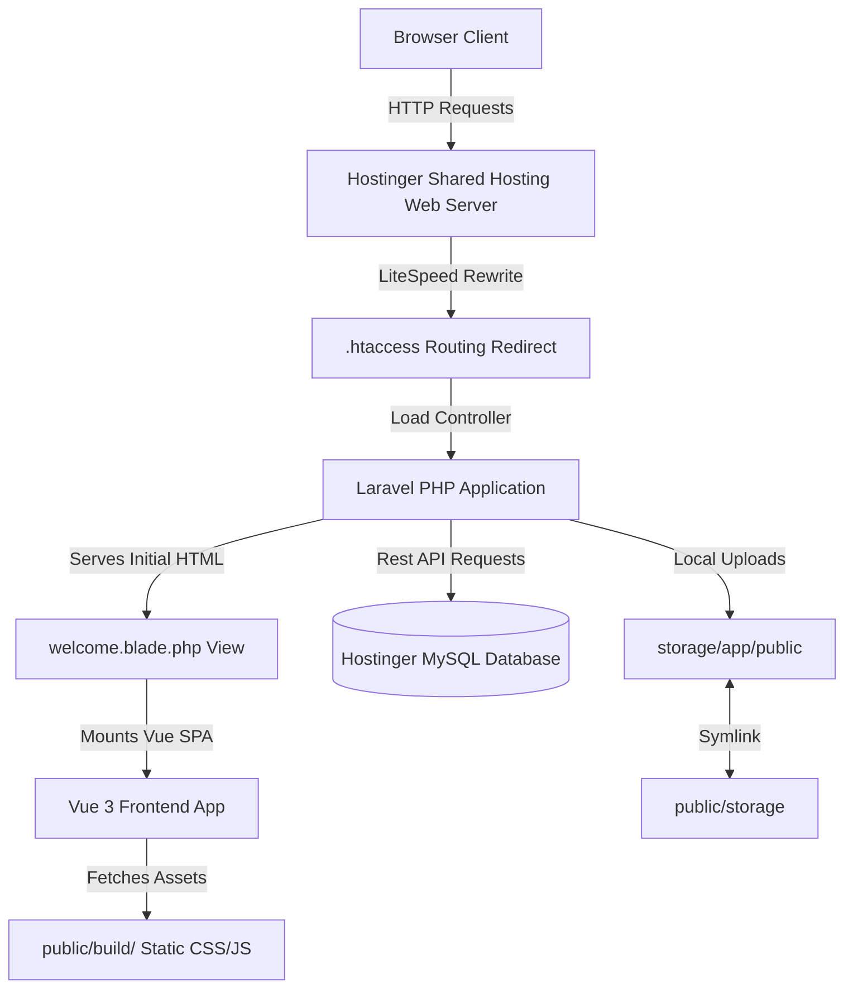

# TrustCare Workshop Management System - Development & Deployment Guide

This project is a full-stack Garage ERP built using **Laravel (PHP)** for the backend/API and **Vue 3 (Vite + TypeScript/TSX)** for the frontend single-page application. 

It is specially optimized to run on **Hostinger Shared Hosting** while respecting resource constraints and strict **Inode (file count) limits**.

---

## 1. System Architecture Overview



* **Frontend:** Vue 3, Vue Router, and Pinia. Located in `resources/js/`. Single Page Application (SPA) mounted inside `#root` in `resources/views/welcome.blade.php`.
* **Backend:** Laravel 11+ REST API. Handles routing, controllers, models, and security middleware.
* **Asset Pipeline:** Vite compiles frontend resources locally into static assets stored in `public/build/`.
* **Server Runtime:** LiteSpeed/Apache running PHP (8.3/8.4+) and MySQL. **No Node.js runtime process is needed on the server.**

---

## 2. Inode Optimization (Hostinger Shared Hosting Limits)

Hostinger Shared Hosting has strict limits on **Inodes** (the total number of files and directories). Standard framework configurations can easily exceed these limits. To maintain low inode counts, this repository enforces the following rules:

### A. No Node.js / `node_modules` on the Server
* The frontend build is compiled on the local machine (`npm run build`). Only the compiled static assets in `public/build/` are tracked and deployed. 
* **Do NOT upload the `node_modules/` folder.** (Saves **20,000+ inodes**).

### B. Pruned Composer Dependencies
* The production `/vendor` directory must be compiled without dev packages (such as PHPUnit, Faker, Mockery, etc.). 
* When packaging the vendor folder, run:
  ```bash
  composer install --no-dev --optimize-autoloader
  ```
  (Saves **~2,000 inodes**).

### C. Folder Exclusions
* Caches, local sqlite files, package lock backups, and tests are excluded from the server.

---

## 3. Hostinger Deployment Workflows

### Option A: Hostinger Git Auto-Deployment (Recommended)
This project is connected directly to your Hostinger deployment webhook. Any push to the `main` branch will automatically pull changes to the server.

#### Webhook Setup on GitHub:
1. Navigate to: `https://github.com/amicreation/trustcare-workshop-system/settings/hooks/new`
2. **Payload URL:** `https://webhooks.hostinger.com/deploy/480c0dc9df7f6abe2b3fcd8ba23336b2`
3. **Content type:** `application/json`
4. **Triggers:** Just the `push` event.
5. Click **Add Webhook**.

#### Working with Git Auto-Deployment:
Since Hostinger does not compile assets on git pull, you must compile your frontend locally and track the build files in Git:
1. Comment out `/public/build` in `.gitignore` (already done).
2. Run `npm run build` locally.
3. Commit and push the `public/build/` directory to GitHub.
4. Hostinger will pull the pre-built files instantly.
5. Upload the `/vendor` folder once (via File Manager using `vendor.zip`), as it is not tracked in Git.

---

### Option B: Manual Zip Deployment
If you do not want to use Git, run the local packaging script to compile assets, prune dependencies, and bundle them:
```bash
node build-zip.cjs
```
This generates `release.zip` in the project root. Upload `release.zip` to your Hostinger directory and extract it.

---

## 4. Secure Web-Based Database Migrations

Hostinger shared hosting plans often lack SSH access. To run database migrations and link the upload folder, visit this URL in your web browser:

`https://shreeramcaterers.com/deploy/migrate/{DEPLOY_SECRET}`

* **Configuring the Secret:** In your Hostinger `.env` file, set `DEPLOY_SECRET=your_secret_key`.
* **Execution:** Accessing `https://shreeramcaterers.com/deploy/migrate/your_secret_key` will automatically:
  1. Execute `php artisan migrate --force` (creating database tables).
  2. Execute `php artisan storage:link` (linking the upload directory for inspection sheets/photos).

---

## 5. Mandatory Instructions for Future Developers & AI Agents

If you are a developer or an AI coding agent modifying this codebase, you **must** adhere to the following rules:

1. **Do NOT add `node_modules` or `.env` files to Git:** Keep them ignored to prevent server upload bloating and credential leakage.
2. **Maintain the Root `.htaccess`:** Do not remove the root-level `.htaccess` file. Hostinger LiteSpeed server relies on this file to rewrite incoming domain traffic into the `/public` directory.
3. **Track Compiled Frontend Assets:** Do not add `/public/build` back to `.gitignore`. Before pushing any front-end changes (Vue/CSS/TS/TSX) to GitHub, **always run `npm run build`** locally so the compiled assets are pushed to GitHub.
4. **Minimize Packages:** Do not add unnecessary Composer packages or Node dependencies to keep file sizes and inode counts small.
5. **Preserve the `/deploy/migrate/{secret}` Route:** Do not delete or block the web-based migration route in `routes/web.php`. It is the only way to run database schema updates on the shared hosting server.
